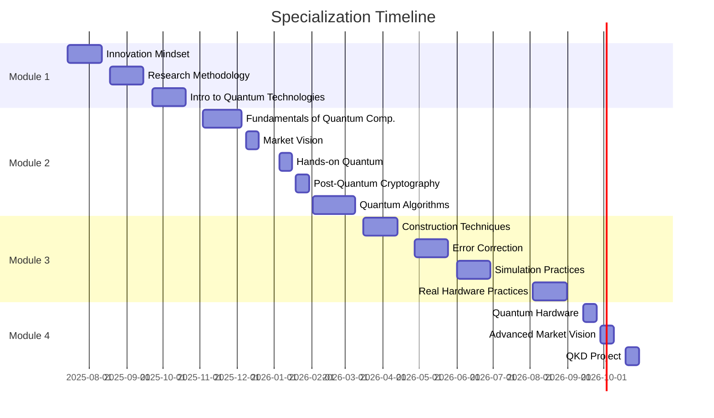

<div align="center">

# 🌌 Specialization in Quantum Computing

### SENAI CIMATEC | 2025-2026

[](https://github.com/davidsonclem/senai-quantum)
[](https://www.python.org/)
[](https://qiskit.org/)
[]()

[🇧🇷 Portuguese](README_pt.md) 

</div>

---

## 📚 About the Course

This repository documents my journey through the **Specialization in Quantum Computing** at SENAI CIMATEC, with a total workload of **360 hours**. The course covers everything from theoretical foundations to practical applications on real quantum computers, including algorithms, post-quantum cryptography, error correction, and applied project development.

**Period:** July/2025 - October/2026  
**Institution:** SENAI CIMATEC  
**Mode:** Online with synchronous sessions (Webclass)

---

## 🎯 Repository Objectives

- 📝 Document learnings and projects developed during the course
- 💻 Share practical implementations of quantum algorithms
- 🔬 Record experiments on simulators and real quantum computers
- 📊 Present research results and analyses
- 🤝 Contribute to the quantum computing community

---

## 📋 Course Structure

### 📖 Module 1: Fundamentals and Methodology

| Course Unit | Description |
|:---|:---|
| **Innovation Mindset** | Development of innovative and creative mentality |
| **Research Methodology** | Scientific methods and research structuring |
| **Introduction to Quantum Technologies** | Fundamentals of quantum physics and its applications |

### 🔬 Module 2: Quantum Fundamentals

| Course Unit | Description |
|:---|:---|
| **Fundamentals of Quantum Computing** | Qubits, quantum gates, entanglement |
| **Market Vision in Quantum Technologies** | Market overview and opportunities |
| **Quantum Computing: Hands-on Approach** | Initial practices with quantum tools |
| **Fundamentals of Post-Quantum Cryptography** | Security in the quantum era |
| **Quantum Algorithms** | Shor, Grover, VQE and other algorithms |

### 💻 Module 3: Development and Applications

| Course Unit | Description |
|:---|:---|
| **Quantum Algorithm Construction Techniques** | Quantum circuit design and optimization |
| **Error Correction and Mitigation** | QEC techniques and noise mitigation |
| **Practices in Simulation Environments** | Qiskit, Cirq, PennyLane simulators |
| **Practices on Quantum Computers** | Execution on real hardware (IBM, IonQ) |

### 🚀 Module 4: Specialization and Projects

| Course Unit | Description |
|:---|:---|
| **Hardware for Quantum Computing** | Quantum hardware technologies |
| **Market Vision (Advanced)** | Trends and use cases |
| **QKD Project Workshop** | Quantum Key Distribution |

---

## 🗂️ Repository Structure

```
senai-quantum/
├── 01-mindset-inovacao/
│   ├── anotacoes.md
│   ├── quiz/
│   └── hands-on/
├── 02-metodologia-pesquisa/
│   ├── projeto-pesquisa.md
│   └── referencias.bib
├── 03-intro-tecnologias-quanticas/
│   ├── conceitos-fundamentais.md
│   └── exercicios/
├── 04-fundamentos-computacao-quantica/
│   ├── qubits-e-portas.ipynb
│   ├── emaranhamento.ipynb
│   └── circuitos-basicos/
├── 05-visao-mercado/
│   ├── analise-mercado.md
│   └── casos-de-uso/
├── 06-hands-on-quantum/
│   ├── primeiros-circuitos/
│   └── experimentos-qiskit/
├── 07-criptografia-pos-quantica/
│   ├── algoritmos-classicos.md
│   ├── algoritmos-pos-quanticos.md
│   └── implementacoes/
├── 08-algoritmos-quanticos/
│   ├── deutsch-jozsa/
│   ├── grover/
│   ├── shor/
│   ├── vqe/
│   └── qaoa/
├── 09-tecnicas-construcao/
│   ├── otimizacao-circuitos/
│   ├── ansatz-design/
│   └── projetos/
├── 10-correcao-erros/
│   ├── codigos-quanticos/
│   ├── mitigacao-ruido/
│   └── experimentos/
├── 11-praticas-simulacao/
│   ├── qiskit-aer/
│   ├── cirq-simuladores/
│   └── pennylane/
├── 12-praticas-hardware-real/
│   ├── ibm-quantum/
│   ├── ionq/
│   └── resultados-experimentos/
├── 13-hardware-quantico/
│   ├── tecnologias.md
│   └── comparativos/
├── 14-visao-mercado-avancado/
│   └── tendencias-2026.md
├── 15-projeto-qkd/
│   ├── proposta.md
│   ├── implementacao/
│   └── apresentacao/
├── docs/
│   ├── calendario-academico.pdf
│   ├── glossario.md
│   └── recursos.md
└── README.md
```

---

## 🛠️ Technologies and Tools

### Languages and Frameworks


### Quantum Platforms


### Scientific Libraries


---

## 📊 Course Progress



**Current Status:** 🟡 Awaiting start - July/2025

---

## 🎓 Expected Learnings

- ✅ Mastery of fundamental concepts of quantum mechanics applied to computing
- ✅ Implementation of classical quantum algorithms (Shor, Grover, Deutsch-Jozsa)
- ✅ Development of variational algorithms (VQE, QAOA)
- ✅ Execution of circuits on real quantum computers
- ✅ Quantum error correction and mitigation techniques
- ✅ Understanding of post-quantum cryptography
- ✅ Viability analysis of quantum computing projects
- ✅ Development of applied projects in QKD

---

## 🔬 Featured Projects

*This section will be updated as projects are developed*

1. **Grover's Algorithm for Database Search**
2. **Shor's Algorithm Implementation**
3. **VQE for Quantum Chemistry**
4. **QKD System (Final Project)**
5. **Comparative Analysis: Simulators vs Real Hardware**

---

## 📚 Resources and References

### Books
- Nielsen & Chuang - *Quantum Computation and Quantum Information*
- Hidary - *Quantum Computing: An Applied Approach*
- Sutor - *Dancing with Qubits*

### Online Courses
- [IBM Quantum Learning](https://learning.quantum.ibm.com/)
- [Qiskit Textbook](https://qiskit.org/textbook/)
- [MIT OpenCourseWare - Quantum Computing](https://ocw.mit.edu/)

### Articles and Papers
- [arXiv Quantum Physics](https://arxiv.org/list/quant-ph/recent)
- [Nature Quantum Information](https://www.nature.com/npjqi/)

---

## 👨‍💻 About the Author

**Davidson Clem**  
Systems Analyst | AI & Quantum Computing Specialist | Data Scientist

- 🔬 Researcher at DECEx (Brazilian Army Department of Education and Culture)
- 🎓 Postgraduate Student in Quantum Computing (SENAI CIMATEC)
- 🎓 Postgraduate Student in Data Analysis (UFRRJ)
- 💼 Experience in systems development and applied AI

[](https://www.linkedin.com/in/davidson-clem/)
[](mailto:davidson.clem@yahoo.com.br)
[](http://lattes.cnpq.br/9426087283435184)
[](https://onama.online/)

## 📝 License

This repository is maintained for educational and personal documentation purposes. All content developed during the course follows SENAI CIMATEC guidelines.

---

<div align="center">

### ⚛️ *"The future is quantum"* ⚛️

**Last update:** December/2024


</div>
