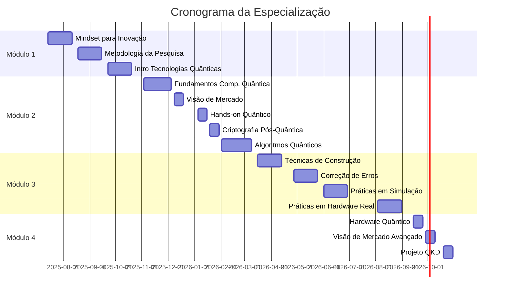

<div align="center">

# 🌌 Especialização em Computação Quântica

### SENAI CIMATEC | Turma 98895 | 2025-2026

[](https://github.com/davidsonclem/senai-quantum)
[](https://www.python.org/)
[](https://qiskit.org/)
[]()

[🇧🇷 Portuguese](README_pt.md) | [🇺🇸 English](README.en.md)

</div>

---

## 📚 Sobre o Curso

Este repositório documenta minha jornada na **Especialização em Computação Quântica** pelo SENAI CIMATEC, com carga horária total de **360 horas**. O curso abrange desde fundamentos teóricos até aplicações práticas em computadores quânticos reais, incluindo algoritmos, criptografia pós-quântica, correção de erros e desenvolvimento de projetos aplicados.

**Período:** Julho/2025 - Outubro/2026  
**Instituição:** SENAI CIMATEC  
**Modalidade:** Online com momentos síncronos (Webclass)

---

## 🎯 Objetivos do Repositório

- 📝 Documentar aprendizados e projetos desenvolvidos durante o curso
- 💻 Compartilhar implementações práticas de algoritmos quânticos
- 🔬 Registrar experimentos em simuladores e computadores quânticos reais
- 📊 Apresentar resultados de pesquisas e análises
- 🤝 Contribuir com a comunidade de computação quântica

---

## 📋 Estrutura do Curso

### 📖 Módulo 1: Fundamentos e Metodologia

| Unidade Curricular | Descrição |
|:---|:---|
| **Mindset para Inovação** | Desenvolvimento de mentalidade inovadora e criativa |
| **Metodologia da Pesquisa** | Métodos científicos e estruturação de pesquisas |
| **Introdução às Tecnologias Quânticas** | Fundamentos da física quântica e suas aplicações |

### 🔬 Módulo 2: Fundamentos Quânticos

| Unidade Curricular | Descrição |
|:---|:---|
| **Fundamentos da Computação Quântica** | Qubits, portas quânticas, emaranhamento |
| **Visão de Mercado em Tecnologias Quânticas** | Panorama do mercado e oportunidades |
| **Computação Quântica: Abordagem Hands-on** | Práticas iniciais com ferramentas quânticas |
| **Fundamentos da Criptografia Pós-Quântica** | Segurança na era quântica |
| **Algoritmos Quânticos** | Shor, Grover, VQE e outros algoritmos |

### 💻 Módulo 3: Desenvolvimento e Aplicações

| Unidade Curricular | Descrição |
|:---|:---|
| **Técnicas de Construção de Algoritmos Quânticos** | Design e otimização de circuitos quânticos |
| **Correção e Mitigação de Erros** | Técnicas de QEC e mitigação de ruído |
| **Práticas em Ambientes de Simulação** | Simuladores Qiskit, Cirq, PennyLane |
| **Práticas em Computadores Quânticos** | Execução em hardware real (IBM, IonQ) |

### 🚀 Módulo 4: Especialização e Projetos

| Unidade Curricular | Descrição |
|:---|:---|
| **Hardware para Computação Quântica** | Tecnologias de hardware quântico |
| **Visão de Mercado (Avançado)** | Tendências e casos de uso |
| **Oficina de Projetos em QKD** | Distribuição Quântica de Chaves |

---

## 🗂️ Estrutura do Repositório

```
senai-quantum/
├── 01-mindset-inovacao/
│   ├── anotacoes.md
│   ├── quiz/
│   └── hands-on/
├── 02-metodologia-pesquisa/
│   ├── projeto-pesquisa.md
│   └── referencias.bib
├── 03-intro-tecnologias-quanticas/
│   ├── conceitos-fundamentais.md
│   └── exercicios/
├── 04-fundamentos-computacao-quantica/
│   ├── qubits-e-portas.ipynb
│   ├── emaranhamento.ipynb
│   └── circuitos-basicos/
├── 05-visao-mercado/
│   ├── analise-mercado.md
│   └── casos-de-uso/
├── 06-hands-on-quantum/
│   ├── primeiros-circuitos/
│   └── experimentos-qiskit/
├── 07-criptografia-pos-quantica/
│   ├── algoritmos-classicos.md
│   ├── algoritmos-pos-quanticos.md
│   └── implementacoes/
├── 08-algoritmos-quanticos/
│   ├── deutsch-jozsa/
│   ├── grover/
│   ├── shor/
│   ├── vqe/
│   └── qaoa/
├── 09-tecnicas-construcao/
│   ├── otimizacao-circuitos/
│   ├── ansatz-design/
│   └── projetos/
├── 10-correcao-erros/
│   ├── codigos-quanticos/
│   ├── mitigacao-ruido/
│   └── experimentos/
├── 11-praticas-simulacao/
│   ├── qiskit-aer/
│   ├── cirq-simuladores/
│   └── pennylane/
├── 12-praticas-hardware-real/
│   ├── ibm-quantum/
│   ├── ionq/
│   └── resultados-experimentos/
├── 13-hardware-quantico/
│   ├── tecnologias.md
│   └── comparativos/
├── 14-visao-mercado-avancado/
│   └── tendencias-2026.md
├── 15-projeto-qkd/
│   ├── proposta.md
│   ├── implementacao/
│   └── apresentacao/
├── docs/
│   ├── calendario-academico.pdf
│   ├── glossario.md
│   └── recursos.md
└── README.md
```

---

## 🛠️ Tecnologias e Ferramentas

### Linguagens e Frameworks


### Plataformas Quânticas


### Bibliotecas Científicas


---

## 📊 Progresso do Curso



**Status Atual:** 🟡 Aguardando início - Julho/2025

---

## 🎓 Aprendizados Esperados

- ✅ Domínio de conceitos fundamentais de mecânica quântica aplicada à computação
- ✅ Implementação de algoritmos quânticos clássicos (Shor, Grover, Deutsch-Jozsa)
- ✅ Desenvolvimento de algoritmos variacionais (VQE, QAOA)
- ✅ Execução de circuitos em computadores quânticos reais
- ✅ Técnicas de correção e mitigação de erros quânticos
- ✅ Compreensão de criptografia pós-quântica
- ✅ Análise de viabilidade de projetos em computação quântica
- ✅ Desenvolvimento de projetos aplicados em QKD

---

## 🔬 Projetos Destacados

*Esta seção será atualizada conforme os projetos forem desenvolvidos*

1. **Algoritmo de Grover para Busca em Bases de Dados**
2. **Implementação do Algoritmo de Shor**
3. **VQE para Química Quântica**
4. **Sistema de QKD (Projeto Final)**
5. **Análise Comparativa: Simuladores vs Hardware Real**

---

## 📚 Recursos e Referências

### Livros
- Nielsen & Chuang - *Quantum Computation and Quantum Information*
- Hidary - *Quantum Computing: An Applied Approach*
- Sutor - *Dancing with Qubits*

### Cursos Online
- [IBM Quantum Learning](https://learning.quantum.ibm.com/)
- [Qiskit Textbook](https://qiskit.org/textbook/)
- [MIT OpenCourseWare - Quantum Computing](https://ocw.mit.edu/)

### Artigos e Papers
- [arXiv Quantum Physics](https://arxiv.org/list/quant-ph/recent)
- [Nature Quantum Information](https://www.nature.com/npjqi/)

---

## 👨‍💻 Sobre o Autor

**Davidson Clem**  
Analista de Sistemas | Especialista em IA & Computação Quântica | Cientista de Dados

- 🔬 Pesquisador no DECEx (Departamento de Educação e Cultura do Exército)
- 🎓 Pós-Graduando em Computação Quântica (SENAI CIMATEC)
- 🎓 Pós-Graduando em Análise de Dados (UFRRJ)
- 💼 Experiência em desenvolvimento de sistemas e IA aplicada

[](https://www.linkedin.com/in/davidson-clem/)
[](mailto:davidson.clem@yahoo.com.br)
[](http://lattes.cnpq.br/9426087283435184)
[](https://onama.online/)

## 📝 Licença

Este repositório é mantido para fins educacionais e de documentação pessoal. Todo o conteúdo desenvolvido durante o curso segue as diretrizes do SENAI CIMATEC.

---

<div align="center">

### ⚛️ *"O futuro é quântico"* ⚛️

**Última atualização:** Dezembro/2024


</div>
